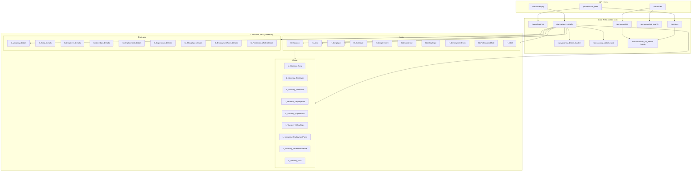
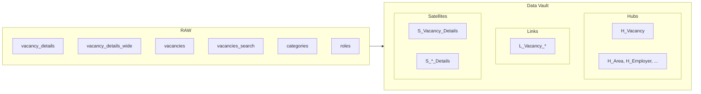

# 06 — Диаграмма слоёв данных

Ниже приведена диаграмма таблиц по слоям и потоков данных. Формат — **Mermaid**: его можно просматривать в GitHub, в VS Code (расширение Mermaid), в Cursor или сгенерировать картинку через [mermaid-cli](https://github.com/mermaid-js/mermaid-cli).

## Как запустить и посмотреть диаграмму

1. **В браузере (онлайн)**  
   Скопируйте блок кода из секции «Код диаграммы» ниже и вставьте в [Mermaid Live Editor](https://mermaid.live/) — диаграмма отрисуется сразу.

2. **В VS Code / Cursor**  
   Установите расширение «Mermaid» (или «Markdown Preview Mermaid Support»). Откройте этот файл и откройте предпросмотр Markdown (Ctrl+Shift+V / Cmd+Shift+V) — диаграмма отобразится в превью.

3. **Экспорт в PNG/SVG (mermaid-cli)**  
   Установите `@mermaid-js/mermaid-cli`, сохраните код в файл `docs/data-flow.mmd` и выполните:
   ```bash
   npx @mermaid-js/mermaid-cli -i docs/data-flow.mmd -o docs/data-flow.png
   ```
   Или используйте поддиаграмму из этого файла (см. ниже отдельный блок для `.mmd`).

4. **В GitHub**  
   В репозитории при просмотре этого `.md` файла GitHub сам рендерит Mermaid-блоки.

---

## Диаграмма: таблицы по слоям и поток данных



---

## Упрощённая схема: только таблицы по слоям (без потоков)

Удобно для быстрого просмотра списка объектов по слоям.



---

## Генерация PNG/SVG (mermaid-cli)

В репозитории уже есть файл `docs/data-flow.mmd` с полной диаграммой. Сгенерировать картинку:

```bash
npx @mermaid-js/mermaid-cli -i docs/data-flow.mmd -o docs/data-flow.png
```

Для SVG замените расширение выхода на `-o docs/data-flow.svg`. Требуется установленный Node.js и (при первом запуске) загрузка пакета mermaid-cli.
